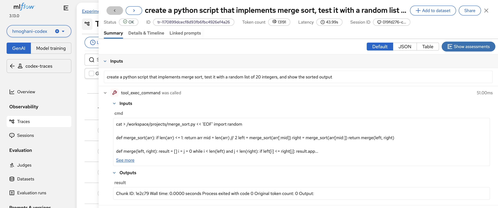

# MLflow Tracing for Codex CLI on OpenShift

Extends the Codex CLI deployment with MLflow experiment tracking via the `@mlflow/codex` notify hook. Each agent turn is exported as a trace to MLflow, capturing inputs, outputs, token usage, and (when available) child spans for LLM calls and tool invocations.

## Architecture

```text
┌─────────────────────────────────────────────────────────┐
│  Codex Pod (codex-mlflow:latest)                        │
│                                                         │
│  entrypoint.sh                                          │
│       │                                                 │
│       ▼                                                 │
│  setup-mlflow.sh                                        │
│   ├─ Load SA token for MLflow auth                      │
│   ├─ Create experiment via Python mlflow SDK             │
│   ├─ Write mlflow-tracing.json (tracking URI + exp ID)  │
│   ├─ Register notify hook in config.toml                │
│   └─ exec sleep infinity                                │
│                                                         │
│  oc exec -it → codex "prompt"                           │
│       │                                                 │
│       ▼                                                 │
│  codex (interactive) fires notify hook natively          │
│       │                                                 │
│       ▼                                                 │
│  @mlflow/codex  ─────────────────────────────────────►  │
└─────────────────────────────────────────────────────────┘
                                                    │
                                          HTTPS + SA token
                                          service-ca.crt TLS
                                          X-MLFLOW-WORKSPACE
                                                    │
                                                    ▼
                              ┌──────────────────────────────┐
                              │  MLflow (redhat-ods-apps)     │
                              │  /mlflow/api/2.0/mlflow/...   │
                              │                              │
                              │  Experiment: codex-traces    │
                              │  Auth: kubernetes-namespaced │
                              └──────────────────────────────┘
```

## Prerequisites

- Codex deployment running in a namespace (base image from [PR #251](https://github.com/red-hat-data-services/agentic-starter-kits/pull/251))
- MLflow deployed via RHOAI operator (reachable at `mlflow.redhat-ods-applications.svc.cluster.local:8443`)
- vLLM inference endpoint serving `/v1/responses` with tool calling enabled (e.g., Qwen3.6-27B with `qwen3_coder` parser)

## Image Build

The MLflow layer extends the base Codex image with Python 3.12, Node.js 20, MLflow SDK, and `@mlflow/codex`:

```bash
# Create ImageStream and BuildConfig
oc apply -f - <<EOF
apiVersion: image.openshift.io/v1
kind: ImageStream
metadata:
  name: codex-mlflow
---
apiVersion: build.openshift.io/v1
kind: BuildConfig
metadata:
  name: codex-mlflow
spec:
  source:
    type: Binary
  strategy:
    type: Docker
    dockerStrategy:
      dockerfilePath: Containerfile.mlflow
      from:
        kind: ImageStreamTag
        name: codex:latest
  output:
    to:
      kind: ImageStreamTag
      name: codex-mlflow:latest
EOF

# Build
oc start-build codex-mlflow --from-dir=. --follow
```

### Image Contents

| Layer | Package | Version | Purpose |
|-------|---------|---------|---------|
| Python | python3.12 + pip | 3.12.x | MLflow SDK, experiment creation |
| Node.js | Node.js from official tarball | 20.19.2 | `@mlflow/codex` notify hook CLI |
| MLflow SDK | `mlflow[kubernetes]` | >=3.14 | Trace export, experiment management |
| @mlflow/codex | Built from source (v3.14.0) | 3.14.0 | Codex notify hook for MLflow tracing |

`@mlflow/codex` is built from source because the npm package (as of v3.14.0) lacks the `X-MLFLOW-WORKSPACE` header needed for RHOAI's kubernetes-namespaced auth (upstream issue: mlflow#23927).

## Authentication, TLS, and RBAC

Follow the shared guide at [docs/mlflow-openshift-auth-and-tls.md](../../../../docs/mlflow-openshift-auth-and-tls.md). The key steps for Codex:

1. **RBAC** — Bind the `mlflow-integration` ClusterRole to the pod's service account:

   ```bash
   # Find the ClusterRole name
   oc get clusterroles | grep mlflow-integration

   # Bind it to the default SA in your namespace
   oc -n <namespace> create rolebinding codex-mlflow-integration \
     --clusterrole=<mlflow-integration-clusterrole> \
     --serviceaccount=<namespace>:default
   ```

2. **TLS** — Use the OpenShift service CA (auto-mounted at `/var/run/secrets/kubernetes.io/serviceaccount/service-ca.crt`). The deployment patch sets both `MLFLOW_TRACKING_SERVER_CERT_PATH` (Python SDK) and `NODE_EXTRA_CA_CERTS` (TypeScript SDK) to this path.

3. **Auth** — The deployment patch sets `MLFLOW_TRACKING_AUTH=kubernetes-namespaced`, which auto-reads the SA token and namespace from the pod filesystem.

### Codex-Specific Notes

Codex uses the `@mlflow/codex` TypeScript plugin, which does not read `MLFLOW_TRACKING_AUTH` natively. The `setup-mlflow.sh` entrypoint handles this by reading the SA token from disk and exporting `MLFLOW_TRACKING_TOKEN` before launching. See the [TypeScript SDK: What's Different](../../../../docs/mlflow-openshift-auth-and-tls.md#typescript-sdk-whats-different) section in the shared doc for details.

## Deployment Patch

Patch the existing Codex deployment to use the MLflow image:

```bash
# Switch to MLflow image and chain setup-mlflow.sh after entrypoint
oc patch deployment codex --type=json -p '[
  {"op": "replace", "path": "/spec/template/spec/containers/0/image",
   "value": "image-registry.openshift-image-registry.svc:5000/<namespace>/codex-mlflow:latest"},
  {"op": "replace", "path": "/spec/template/spec/containers/0/args",
   "value": ["setup-mlflow.sh", "sleep", "infinity"]}
]'

# Add env vars (oc set env cannot use fieldRef, so apply the strategic patch
# for MLFLOW_WORKSPACE — or set it manually to your namespace)
oc patch deployment codex --patch-file deployment-mlflow-patch.yaml --type=strategic
```

The strategic patch sets `MLFLOW_WORKSPACE` to the pod's namespace via `fieldRef: metadata.namespace`. The experiment ID is resolved dynamically from `MLFLOW_EXPERIMENT_NAME` by `setup-mlflow.sh`.

## Environment Variables

| Variable | Required | Default | Description |
|----------|----------|---------|-------------|
| `MLFLOW_TRACKING_URI` | Yes | — | MLflow server URL (include `/mlflow` path prefix) |
| `MLFLOW_EXPERIMENT_NAME` | No | `codex-traces` | Experiment name (auto-created if missing) |
| `MLFLOW_TRACKING_AUTH` | No | `kubernetes-namespaced` | Auth plugin for SA token |
| `MLFLOW_TRACKING_SERVER_CERT_PATH` | No | — | Path to CA cert for TLS verification (Python SDK) |
| `NODE_EXTRA_CA_CERTS` | No | — | Path to CA cert for TLS verification (Node.js / TS SDK) |
| `MLFLOW_WORKSPACE` | Auto | Pod namespace | Namespace for `X-MLFLOW-WORKSPACE` header |

## Usage

Interactive Codex fires the notify hook natively after each turn, so traces are exported automatically:

```bash
oc exec -it deployment/codex -- codex \
  --model qwen3.6-27b \
  -c 'model_provider="vllm"' \
  "explain what 2+2 equals"
```

### Querying Traces

```bash
# Via MLflow REST API
curl -s --cacert /var/run/secrets/kubernetes.io/serviceaccount/service-ca.crt \
  -H "Authorization: Bearer $TOKEN" \
  -H "X-MLFLOW-WORKSPACE: <namespace>" \
  "https://mlflow.redhat-ods-applications.svc:8443/mlflow/api/2.0/mlflow/traces?experiment_ids=<id>&max_results=10"

# Via Python SDK
python3 -c "
import mlflow
mlflow.set_tracking_uri('...')
client = mlflow.MlflowClient()
traces = client.search_traces(experiment_ids=['<id>'])
for t in traces:
    print(t.info.request_id, t.info.status)
"
```

## Trace Results

Validated end-to-end with Qwen3.6-27B via vLLM, producing 10-span traces with tool call child spans.

### vLLM Direct (`qwen3.6-27b`)



## Trace Schema

Each Codex turn produces a trace with the following structure:

```text
Trace (request_id: tr-...)
├── status: OK
├── request_metadata:
│   ├── mlflow.traceInputs: "<user prompt>"
│   ├── mlflow.traceOutputs: "<assistant response>"
│   ├── mlflow.trace.session: "<codex session uuid>"
│   ├── mlflow.trace.tokenUsage:
│   │   ├── input_tokens: 10198
│   │   ├── output_tokens: 369
│   │   └── total_tokens: 10567
│   └── mlflow.trace_schema.version: "3"
└── spans:
    └── codex_conversation (AGENT)
        ├── inputs: "<user prompt>"
        ├── outputs: "<assistant response>"
        └── attributes: { model: "qwen3.6-27b" }
            └── [child spans when tool calls present]:
                ├── llm_call (LLM) — model inference
                ├── function_call (TOOL) — apply_patch, shell
                └── function_call_output (TOOL) — tool results
```

### Span Types

| Type | When Created | Contains |
|------|-------------|----------|
| `codex_conversation` (AGENT) | Every turn | Root span, wraps the entire turn |
| `llm_call` (LLM) | Model inference | Model name, messages, token usage |
| `function_call` (TOOL) | Tool invocation | Tool name (apply_patch, shell), arguments |
| `function_call_output` (TOOL) | Tool result | Execution output, exit code |

Child spans are created when the `@mlflow/codex` notify hook can read the session JSONL transcript and finds function call records. Without tool calls (e.g., pure Q&A), only the root `codex_conversation` span is present.

## Known Issues

### Project-Level Config Precedence

`@mlflow/codex` resolves config in this order:

1. `MLFLOW_TRACKING_URI` / `MLFLOW_EXPERIMENT_ID` environment variables
2. `$CWD/.codex/mlflow-tracing.json` (project-level)
3. `~/.codex/mlflow-tracing.json` (user-level)

The `mlflow-codex setup --non-interactive` command writes to the project-level config (CWD) with incorrect defaults (`localhost:5000`, experiment ID `0`). The `setup-mlflow.sh` entrypoint writes the correct values to the user-level config after resolving the experiment ID dynamically.

### Model Tool Call Support

Qwen3-8B via vLLM did not reliably generate tool calls in `codex exec` mode, producing single-span traces. Qwen3.6-27B (served via `docker.io/vllm/vllm-openai:v0.25.1` with `--tool-call-parser qwen3_coder --tensor-parallel-size 2`) is the current recommended model for multi-span traces with tool call child spans.

### OGX Backend Comparison

OGX endpoints were not available in the test namespace. The vLLM-direct path was validated end-to-end. OGX comparison is deferred to when an OGX endpoint is deployed in a namespace with MLflow tracing configured. The trace schema is backend-agnostic — `@mlflow/codex` captures traces at the Codex CLI level, not the inference backend level.

## Files

| File | Description |
|------|-------------|
| `Containerfile.mlflow` | Image layer with Python 3.12, Node.js 20, MLflow SDK, @mlflow/codex |
| `setup-mlflow.sh` | Post-entrypoint setup: SA token, experiment, notify hook, config fixups |
| `deployment-mlflow-patch.yaml` | Strategic merge patch for env vars and image |
| `screenshots/` | MLflow trace screenshots |
| `mlflow-tracing.md` | This document |
