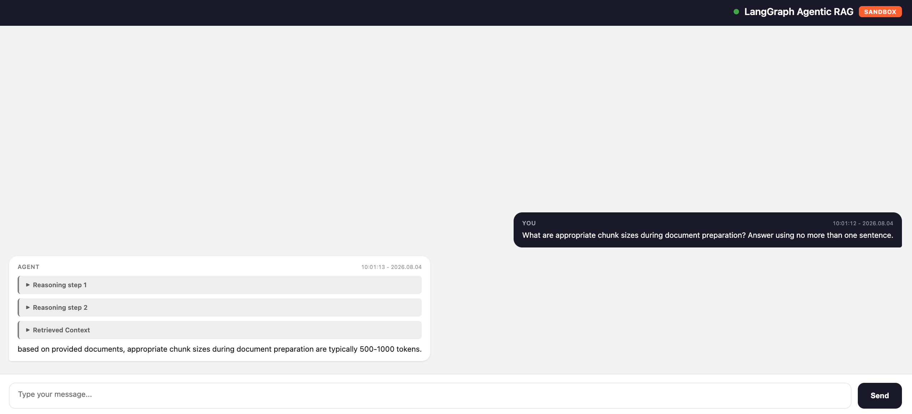

# Agentic RAG in openShell sandbox

Deploy the agentic_rag agent inside an openShell sandbox on OpenShift
with egress control, filesystem isolation, API key authentication, and
a public HTTPS URL — from zero to a queryable agent.

All commands run from `agents/langgraph/templates/agentic_rag/`.

## Prerequisites

- OpenShift cluster with admin access (`oc` logged in)
- `openshell` CLI installed - see [OpenShell installation](https://github.com/NVIDIA/OpenShell?tab=readme-ov-file#installation)
- `helm` v3 installed
- OGX instance with API key, embedding model, and vector store configured
- **Red Hat build of Agent Sandbox** operator installed (namespace `agent-sandbox-system`)

---

## Step 1 — Configure `.env`

```bash
make init   # creates .env from .env.example
```

Edit `.env` and fill in:

| Variable | Example | Description |
|---|---|---|
| `API_KEY` | `eyJhbG...` | OGX API key (JWT from Keycloak) |
| `BASE_URL` | `https://server-ogx.<apps-domain>/v1` | OGX endpoint |
| `MODEL_ID` | `maas-llm/qwen3-8b-fp8-dynamic` | LLM model |
| `EMBEDDING_MODEL` | `maas-embedding/redhataibge-m3` | Embedding model (must be in OGX `allowed_models`) |
| `VECTOR_STORE_PROVIDER` | `milvus-remote` | Vector store backend |

## Step 2 — Install openShell gateway and connect CLI

```bash
make setup-gateway
```

This single command auto-detects `APPS_DOMAIN` from the cluster and:

1. Installs the openShell gateway via Helm (with wildcard SAN for service URLs)
2. Waits for the gateway pod to be ready
3. Disables mTLS client cert requirement (patches `gateway.toml` ConfigMap)
4. Creates a passthrough Route for the gateway
5. Registers the gateway in the openShell CLI
6. Verifies the connection (should print `Connected`)

**Verify the gateway:**

```bash
> oc get pods -n openshell
# NAME          READY   STATUS    RESTARTS   AGE
# openshell-0   1/1     Running   0          2m
```

## Step 3 — Build the sandbox image

```bash
make build-openshell
```

Creates an OpenShift BuildConfig and builds the image using
`Containerfile.openshell` in-cluster. Takes ~2 minutes.

The final output shows:

```bash
# Image ready: image-registry.openshift-image-registry.svc:5000/example-namespace/openshell-agentic-rag:latest
# Next: make deploy-openshell
```

**Verify the build:**

```bash
> oc get builds | grep openshell-agentic-rag
# openshell-agentic-rag-1   Source   Docker   Complete   2m
```

## Step 4 — Deploy

```bash
make deploy-openshell
```

This runs five sub-targets in sequence (each can also be run
independently for debugging):

| Sub-target | What it does |
|---|---|
| `make create-sandbox` | Grants image-pull access, deletes any existing sandbox, creates a new one (120s timeout) |
| `make wait-sandbox` | Polls until the sandbox phase is `Ready` (max 150s) |
| `make setup-egress` | Resolves the python binary path inside the sandbox, adds egress policy for OGX and K8s API |
| `make load-docs-sandbox` | Loads documents into a new vector store, updates `VECTOR_STORE_ID` in `.env` |
| `make start-agent` | Creates `agent-client` SA, generates token (stored in `agent-client-token` Secret), starts uvicorn, exposes the service URL, creates an OpenShift Route |

At the end it prints the agent URL and a curl example.
Total time: ~3 minutes.

**Verify the sandbox:**

Check the route:

```bash
> oc get route -n openshell openshell-rag-agent

# NAME                  HOST/PORT                                           PATH   SERVICES    PORT   TERMINATION   WILDCARD
# openshell-rag-agent   rag-sandbox--agent.openshell.apps.rosa.example.com         openshell   8080   passthrough   None
```

## Step 5 — Test

```bash
AGENT_URL="https://rag-sandbox--agent.openshell.$(oc get ingresses.config cluster -o jsonpath='{.spec.domain}')"

# Get the auto-generated token from the Secret
TOKEN=$(oc get secret agent-client-token -o jsonpath='{.data.token}' | base64 -d)

# Health check — no auth required
curl -sk "$AGENT_URL/health" | jq .
# Output:
# {"status": "healthy", "agent_initialized": true}
```

```bash
# Without token — 401
curl -sk "$AGENT_URL/chat/completions" -X POST \
  -H "Content-Type: application/json" \
  -d '{"messages":[{"role":"user","content":"hello"}]}'
# Output (error):
# {"error": "Missing API key (use X-Api-Key or Authorization: Bearer header)"}
```

```bash
# With SA token — RAG query
curl -sk "$AGENT_URL/chat/completions" -X POST \
  -H "Content-Type: application/json" \
  -H "X-Api-Key: $TOKEN" \
  -d '{"messages":[{"role":"user","content":"What are appropriate chunk sizes during document preparation? Answer using no more than one sentence."}]}' \
  | jq '.choices[0].message'
```

**Expected output:**

```json
{
  "role": "assistant",
  "content": "<think>\nOkay, let's see. The user is asking about appropriate chunk sizes during document preparation. I need to find the answer in the provided documents.\n\nLooking at Document 1, under Best Practices for RAG Systems, point 1. Document Preparation mentions \"Use appropriate chunk sizes (typically 500-1000 tokens)\". That seems to directly answer the question. \n\nI should check other documents to make sure there's no conflicting information. Document 3 talks about text splitters for chunking documents, but doesn't specify the size. Document 5 is about embeddings and doesn't mention chunk sizes. So the answer is from Document 1. The answer should be a single sentence starting with \"based on provided documents\".\n</think>\n\nbased on provided documents, appropriate chunk sizes during document preparation are typically 500-1000 tokens."
}
```

The response includes the agent's `<think>` reasoning process followed by the final answer grounded in retrieved documents.

---

## Step 6 — Interactive Playground (Optional)

For a better experience, use the web-based playground UI instead of curl:

```bash
make playground-sandbox
```

This starts a Flask web UI on <http://localhost:5002> that:

- Auto-fetches the agent URL from the OpenShift Route
- Auto-fetches the SA token from the `agent-client-token` Secret
- Provides a chat interface with streaming responses
- Maintains conversation history across messages
- Collapses reasoning steps and retrieved context into expandable sections



**Requirements:**

- `oc` CLI logged into OpenShift with access to `openshell` namespace
- Flask (already in dependencies)

To override auto-detection, set `AGENT_URL` and `AGENT_TOKEN` environment variables before running.

---

## How auth works

`auth_wrapper.py` wraps the agent's FastAPI app with an auth
middleware — **no agent source code is modified** (`main.py`, `src/`
are untouched).

- Only `/chat/completions` is protected; `/health` passes through
- **K8s SA token**: `make start-agent` creates a `agent-client`
  ServiceAccount, generates a token (7-day TTL), stores it in
  `agent-client-token` Secret. The agent validates tokens via the
  Kubernetes TokenReview API from inside the sandbox.
- Tokens are sent via `X-Api-Key` header.
- `Containerfile.openshell` uses `auth_wrapper:app` as the uvicorn entrypoint

## Troubleshooting

**Agent returns `null` responses**: Vector store ID doesn't exist or is stale. Clear `VECTOR_STORE_ID=` in `.env`, run `make load-docs-sandbox` to create a new vector store, then restart agent with `make start-agent`.

**Backend returns 401 Unauthorized**: Model backend ServiceAccount token may have expired. Check backend logs and regenerate SA token if needed.

**Embedding model not in allowed list**: Model provider configuration may have empty allowed models list. Verify provider config includes the model name.

## Cleanup

```bash
# Remove sandbox and route
make undeploy-openshell

# Remove gateway, helm release, secrets, build artifacts
make teardown-gateway && oc delete bc,is openshell-agentic-rag 2>/dev/null
```
