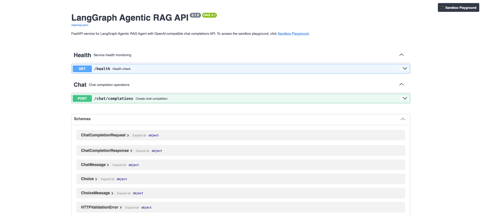

# Agentic RAG in openShell sandbox

Deploy the agentic_rag agent inside an openShell sandbox on OpenShift
with egress control, filesystem isolation, API key authentication, and
a public HTTPS URL — from zero to a queryable agent.

All commands run from `agents/langgraph/templates/agentic_rag/`.

## Prerequisites

- OpenShift cluster with admin access (`oc` logged in)
- `openshell` CLI installed - see [OpenShell installation](https://github.com/NVIDIA/OpenShell?tab=readme-ov-file#installation)
- `helm` v3 installed
- MaaS endpoints for chat and embeddings, plus in-cluster Milvus
- A vector DB Secret containing `MILVUS_SERVER_CERT` as PEM text
- **Red Hat build of Agent Sandbox** operator installed (namespace `agent-sandbox-system`)

---

## Step 1 — Configure `.env`

```bash
make init   # creates .env from .env.example
```

Edit `.env` and fill in:

| Variable | Example | Description |
|---|---|---|
| `MAAS_API_KEY` | `sk-oai-...` | MaaS API key |
| `MAAS_BASE_URL` | `https://maas.<apps-domain>/v1` | MaaS OpenAI-compatible endpoint |
| `MODEL_ID` | `publishers/<org>/models/<model>` | Chat model id |
| `EMBEDDING_MODEL_ID` | `publishers/<org>/models/<model>` | Embedding model id |
| `EMBEDDING_DIMENSION` | `1024` | Must match the embedding model |
| `MILVUS_URI` | `https://milvus-service.milvus.svc.cluster.local:19530` | In-cluster Milvus gRPC endpoint (not a LoadBalancer) |
| `MILVUS_TOKEN` | `root:<password>` | Milvus user:password; `.env` takes precedence over the Secret |
| `MILVUS_SERVER_CERT` | *(leave empty)* | Loaded as PEM text from the vector DB Secret; do not set a file path |
| `MILVUS_SERVER_NAME` | `milvus-service.milvus.svc.cluster.local` | TLS server name for Milvus |
| `VECTOR_DB_SECRET_NAME` | `milvus` | Kubernetes Secret name containing vector DB settings |
| `MILVUS_COLLECTION_NAME` | *(leave empty)* | Filled by `make load-docs-sandbox`, or set to an existing collection |
| `CONTAINER_IMAGE` | *(set after Step 3)* | Image used by the load-docs Job |
| `DOCUMENTS_DIR` | `./data` | Directory with documents to index |
| `CHUNK_SIZE` | `512` | Chunk size for indexing |

The Makefile loads `MILVUS_SERVER_CERT` from `VECTOR_DB_SECRET_NAME` and
passes the PEM text to the sandbox. Explicit values in `.env`, such as
`MILVUS_URI` and `MILVUS_TOKEN`, are preserved and only empty variables are
filled from the Secret.

## Step 2 — Install openShell gateway and connect CLI

```bash
make setup-gateway
```

This single command auto-detects `APPS_DOMAIN` from the cluster and:

1. Installs the openShell gateway via Helm (with wildcard SAN for service URLs)
2. Waits for the gateway pod to be ready
3. Disables mTLS client cert requirement (patches `gateway.toml` ConfigMap)
4. Creates a passthrough Route for the gateway
5. Registers the gateway in the openShell CLI
6. Verifies the connection (should print `Connected`)

**Verify the gateway:**

```bash
> oc get pods -n openshell
# NAME          READY   STATUS    RESTARTS   AGE
# openshell-0   1/1     Running   0          2m
```

## Step 3 — Build the sandbox image

```bash
make build-openshell
```

Creates an OpenShift BuildConfig and builds the image using
`Containerfile.openshell` in-cluster. Takes ~4 minutes. Dependencies are
exported with `uv export --frozen` from the checked-in `uv.lock`.

The final output shows:

```bash
# Image ready: image-registry.openshift-image-registry.svc:5000/example-namespace/openshell-agentic-rag:latest
# Next: make deploy-openshell
```

Set `CONTAINER_IMAGE` in `.env` to that image URL (needed by `make load-docs-sandbox`):

```ini
CONTAINER_IMAGE=image-registry.openshift-image-registry.svc:5000/<namespace>/openshell-agentic-rag:latest
```

**Verify the build:**

```bash
> oc get builds | grep openshell-agentic-rag
# openshell-agentic-rag-1   Source   Docker   Complete   2m
```

## Step 4 — Load documents into Milvus (optional)

***NOTE***: Skip this step if `.env` already has a valid `MILVUS_COLLECTION_NAME`.

```bash
make load-docs-sandbox
```

This runs `scripts/create-load-docs-job-ai4rag.sh`, which:

1. Creates an OpenShift Job in the current namespace using `CONTAINER_IMAGE`
2. Indexes documents from `DOCUMENTS_DIR` (default `./data/sample_knowledge.txt`)
   with ai4rag + MaaS embeddings into in-cluster Milvus
3. Injects `MILVUS_SERVER_CERT` directly from the vector DB Secret as PEM text
4. Writes the new collection name back to `.env` as `MILVUS_COLLECTION_NAME`
5. Auto-deletes the Job after 10 minutes

Requires: image from Step 3, `CONTAINER_IMAGE` set, the vector DB Secret with
`MILVUS_SERVER_CERT`, and egress from the Job namespace to MaaS + Milvus.

Optional check after indexing (sandbox must already exist — run this after Step 5
if you want to verify from inside the sandbox):

```bash
make check-collection  # run after step 5 to check collection
```

## Step 5 — Deploy

`MILVUS_COLLECTION_NAME` must be set in `.env` before this step
(`make start-agent` fails without it).

```bash
make deploy-openshell
```

This runs five sub-targets in sequence (each can also be run
independently for debugging):

| Sub-target | What it does |
|---|---|
| `make create-sandbox` | Grants image-pull access, deletes any existing sandbox, creates a new one (120s timeout) with MaaS + Milvus env vars |
| `make wait-sandbox` | Polls until the sandbox phase is `Ready` (max 150s) |
| `make setup-egress` | Adds egress for MaaS chat, MaaS embeddings, Kubernetes API, and Milvus gRPC (`tls: skip`) |
| `make start-agent` | Creates `agent-client` SA, generates token (stored in `agent-client-token` Secret), starts uvicorn with `MILVUS_COLLECTION_NAME` and the PEM from the vector DB Secret |
| `make expose-agent` | Exposes the service URL and creates an OpenShift Route |

At the end it prints the agent URL and a curl example.
Total time: ~3 minutes.

**Verify the sandbox:**

Check the route:

```bash
> oc get route -n openshell openshell-rag-agent

# NAME                  HOST/PORT                                           PATH   SERVICES    PORT   TERMINATION   WILDCARD
# openshell-rag-agent   default--rag-sandbox--agent.openshell.apps.rosa.example.com         openshell   8080   passthrough   None
```

## Step 6 — Test

```bash
AGENT_URL="https://default--rag-sandbox--agent.openshell.$(oc get ingresses.config cluster -o jsonpath='{.spec.domain}')"

# Get the auto-generated token from the Secret
TOKEN=$(oc get secret agent-client-token -o jsonpath='{.data.token}' | base64 -d)

# Health check — no auth required
curl -sk "$AGENT_URL/health" | jq .
# Output:
# {"status": "healthy", "agent_initialized": true}
```

```bash
# Without token — 401
curl -sk "$AGENT_URL/chat/completions" -X POST \
  -H "Content-Type: application/json" \
  -d '{"messages":[{"role":"user","content":"hello"}]}'
# Output (error):
# {"error": "Missing API key (use X-Api-Key or Authorization: Bearer header)"}
```

```bash
# With SA token — RAG query
curl -sk "$AGENT_URL/chat/completions" -X POST \
  -H "Content-Type: application/json" \
  -H "X-Api-Key: $TOKEN" \
  -d '{"messages":[{"role":"user","content":"What are appropriate chunk sizes during document preparation? Answer using no more than one sentence."}]}' \
  | jq '.choices[0].message'
```

**Expected output:**

```json
{
  "role": "assistant",
  "content": "<think>\nOkay, let's see. The user is asking about appropriate chunk sizes during document preparation. I need to find the answer in the provided documents.\n\nLooking at Document 1, under Best Practices for RAG Systems, point 1. Document Preparation mentions \"Use appropriate chunk sizes (typically 500-1000 tokens)\". That seems to directly answer the question. \n\nI should check other documents to make sure there's no conflicting information. Document 3 talks about text splitters for chunking documents, but doesn't specify the size. Document 5 is about embeddings and doesn't mention chunk sizes. So the answer is from Document 1. The answer should be a single sentence starting with \"based on provided documents\".\n</think>\n\nbased on provided documents, appropriate chunk sizes during document preparation are typically 500-1000 tokens."
}
```

The response includes the agent's `<think>` reasoning process followed by the final answer grounded in retrieved documents.

---

## API documentation (Swagger UI)

The agent exposes interactive API docs via FastAPI's built-in Swagger UI at `/docs`:

```text
https://default--rag-sandbox--agent.openshell.<APPS_DOMAIN>/docs
```



The `/docs` and `/health` endpoints are unauthenticated — only
`/chat/completions` requires an API key.

Swagger UI includes a **Sandbox Playground** shortcut and an instruction at the
top of the page. In the sandbox image, both the root URL (`/`) and `/playground`
serve the sandbox Playground directly, using the same public Route as Swagger.

The embedded Playground requires the `agent-client` token. Paste the value
from `agent-client-token` into its API token field; it is sent as `X-Api-Key`.

---

## Step 7 — Interactive Playground

`make deploy-openshell` starts the agent and exposes both Swagger UI and the
sandbox Playground through the same Route. After deployment, open:

```text
https://default--rag-sandbox--agent.openshell.<APPS_DOMAIN>/
```

The Playground:

- Requires the `agent-client` ServiceAccount token in the API token field
- Provides a chat interface with streaming responses
- Maintains conversation history across messages
- Collapses reasoning steps and retrieved context into expandable sections


---

## How auth works

`auth_wrapper.py` wraps the agent's FastAPI app with an auth
middleware — **no agent source code is modified** (`main.py`, `src/`
are untouched).

- `/chat/completions` and the playground proxy `/api/chat` are protected;
  `/health` and `/docs` pass through
- **K8s SA token**: `make start-agent` creates a `agent-client`
  ServiceAccount, generates a token (7-day TTL), stores it in
  `agent-client-token` Secret. The agent validates tokens via the
  Kubernetes TokenReview API from inside the sandbox.
- Tokens are sent via `X-Api-Key` header.
- `Containerfile.openshell` uses `auth_wrapper:app` as the uvicorn entrypoint
- The openShell gateway is deployed with `allowUnauthenticatedUsers=true` —
  this is intentional. The gateway itself does not enforce authentication;
  instead, `auth_wrapper.py` inside the sandbox validates K8s SA tokens
  on a per-endpoint basis.
- The agent process runs in the background without a supervisor (`&`).
  If it crashes, re-run `make start-agent` then `make expose-agent`.
  For production deployments, consider adding a process supervisor or relying
  on Kubernetes restart policies.

## Troubleshooting

**Agent returns `null` responses / empty retrieval**: Collection is missing or stale.
Clear `MILVUS_COLLECTION_NAME=` in `.env`, run `make load-docs-sandbox`, then restart
with `make start-agent` and `make expose-agent`. Verify with `make check-collection`.

**TLS errors talking to Milvus**: Confirm the vector DB Secret named by
`VECTOR_DB_SECRET_NAME` contains a `MILVUS_SERVER_CERT` key with PEM text.
The certificate is not baked into the sandbox image.

**`ERROR: MILVUS_COLLECTION_NAME not set`**: Run `make load-docs-sandbox` before
`make deploy-openshell`, or point `.env` at an existing collection.

**Backend returns 401 Unauthorized**: Model backend ServiceAccount token may have expired. Check backend logs and regenerate SA token if needed.

**Embedding model not in allowed list**: Model provider configuration may have empty allowed models list. Verify provider config includes the model name.

**openShell CLI connection issues**: If `openshell` commands fail with TLS errors, refresh client certificates with `make refresh-certs`.

**Playground is not available at `/`**: The embedded Playground requires a
recent sandbox image. Rebuild and redeploy with `make build-openshell` and
`make deploy-openshell`. As a temporary fallback for an older image, run
`make playground-sandbox` locally.

## Cleanup

```bash
# Remove sandbox and route
make undeploy-openshell

# Remove gateway, helm release, secrets, build artifacts
make teardown-gateway && oc delete bc,is openshell-agentic-rag 2>/dev/null
```
